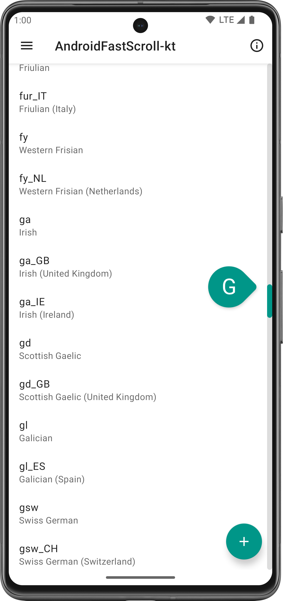
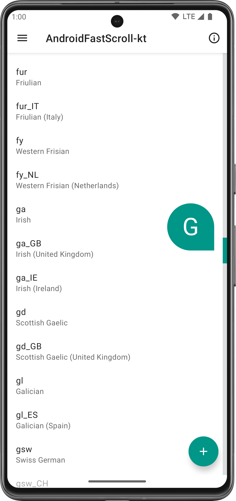

# AndroidFastScroll-kt

Fast scroll for Android `RecyclerView`.Add listener for mThumbView state changes

- This is a fork of [AndroidFastScroll-kt](https://github.com/StellarSand/AndroidFastScroll-kt).


## Contents
- [Why AndroidFastScroll-kt?](#why-androidfastscroll-kt)
- [Preview](#preview)
- [Integration](#integration)
- [Usage](#usage)
- [License](#license)


## Why AndroidFastScroll-kt?
- **Fully customizable:** Override track, thumb, popup, animation and scrolling.
- **Easy-to-use defaults:** Predefined default style, Material Design 1 style and animation.
- **Better popup position:** Considers adjacent items instead of first visible item, enhancing the popup position during fast scrolling for a more intuitive user experience.
- **Extensive view support:** Out-of-box support for `RecyclerView`, `ScrollView`, `NestedScrollView` and `WebView`, plus any view with a `ViewHelper` implementation.
- **Window insets friendly:** Support setting a separate padding for scrollbar.
- **Clean implementation:** Decoupled touch handling, animation and scrolling logic.


## Preview

https://github.com/StellarSand/AndroidFastScroll-kt/assets/68168200/c9fb4ce0-5c0a-43ad-b9bc-06a611b1e1c4


| Default style | Material Design 1 style |
| - | - |
|  |  |


## Integration

#### 1. In `settings.gradle`
- Kotlin:
```gradle
dependencyResolutionManagement {
    repositoriesMode.set(RepositoriesMode.FAIL_ON_PROJECT_REPOS)
    repositories {
        // .. other stuff ..
        maven("https://jitpack.io")
    }
}
```

- Groovy:
```gradle
dependencyResolutionManagement {
    repositoriesMode.set(RepositoriesMode.FAIL_ON_PROJECT_REPOS)
    repositories {
        // .. other stuff ..
        maven { url 'https://jitpack.io' }
    }
}
```

#### 2. In app `build.gradle`
- Kotlin:
```gradle
dependencies {
    // .. other stuff ..
    implementation("com.github.jahirxtrap:AndroidFastScroll-kt:1.0.9")
}
```

- Groovy:
```gradle
dependencies {
    // .. other stuff ..
    implementation 'com.github.jahirxtrap:AndroidFastScroll-kt:1.0.9'
}
```


## Usage
- Simply create a `FastScroller` as follows:
```kotlin
FastScrollerBuilder(recyclerView).build()
```

- To show a popup, implement [`PopupTextProvider`](AndroidFastScroll-kt/src/main/java/me/stellarsand/android/fastscroll/PopupTextProvider.kt) in your `RecyclerView.Adapter`.
```kotlin
class RvAdapter(
  private val aListViewItems: ArrayList<RvData>
): RecyclerView.Adapter<RvAdapter.ListViewHolder>(), PopupTextProvider {

  // .... other code ....

  override fun getPopupText(view: View, position: Int): CharSequence {
    return aListViewItems[position].title.substring(0, 1)
  }

}
```

- For more customization, please use the methods on [`FastScrollerBuilder`](AndroidFastScroll-kt/src/main/java/me/stellarsand/android/fastscroll/FastScrollerBuilder.kt). Namely:
  - `setViewHelper()` - allows providing a custom `ViewHelper` to support more views.
  - `setPopupTextProvider()` - allows providing a custom `PopupTextProvider` if your `RecyclerView.Adapter` cannot implement that interface.
  - `setPadding()` - allows setting a custom padding for the scrollbar, instead of the padding of the view.
  - `setTrackDrawable()` and `setThumbDrawable()` - allow setting custom drawables for the scrollbar. The `android:state_pressed` state will be updated for them so you can use a selector. The track drawable needs to have an intrinsic width and the thumb drawable needs to have an intrinsic size, in order to allow proper touch event handling.
  - `setPopupStyle()` - allows customizing the popup view with a lambda that will receive the view.
  - `setAnimationHelper()` - allows providing a custom `AnimationHelper` to use an alternative scrollbar animation.
  - `disableScrollbarAutoHide()` - allows disabling the auto hide animation for scrollbar. This implies using a `DefaultAnimationHelper`.
  - `useDefaultStyle()` and `useMd1Style()` - allow using the predefined styles, which sets the drawables and popup style. `useDefaultStyle()`, as its name suggests, is the default style when a `FastScrollerBuilder` is created.

- The default `ViewHelper` implementation for `RecyclerView` supports both `LinearLayoutManager` and `GridLayoutManager`, but assumes that each item has the same height when calculating scroll, as there's no common way to deal with variable item height. If you know how to measure for scrolling in your specific case, you can provide your own `ViewHelper` implementation and fast scroll will work correctly again.

- If you are using any `RecyclerView.ItemDecoration` that implements `onDrawOver()`, you might be interested in [`FixItemDecorationRecyclerView`](AndroidFastScroll-kt/src/main/java/me/stellarsand/android/fastscroll/FixItemDecorationRecyclerView.kt) which can fix the drawing order.

- If you are using any other library that makes use of `RecyclerView.OnItemTouchListener` (e.g. `recyclerview-selection`), you might be interested in [`FixOnItemTouchListenerRecyclerView`](AndroidFastScroll-kt/src/main/java/me/stellarsand/android/fastscroll/FixOnItemTouchListenerRecyclerView.kt) which can correctly handle cancellations when dispatching touch events to listeners. You may also want to configure this library before others so that this library can take precedence in touch event handling.


## License
This project is licensed under the terms of [Apache v2.0 license](https://github.com/jahirxtrap/AndroidFastScroll-kt/blob/main/LICENSE).
